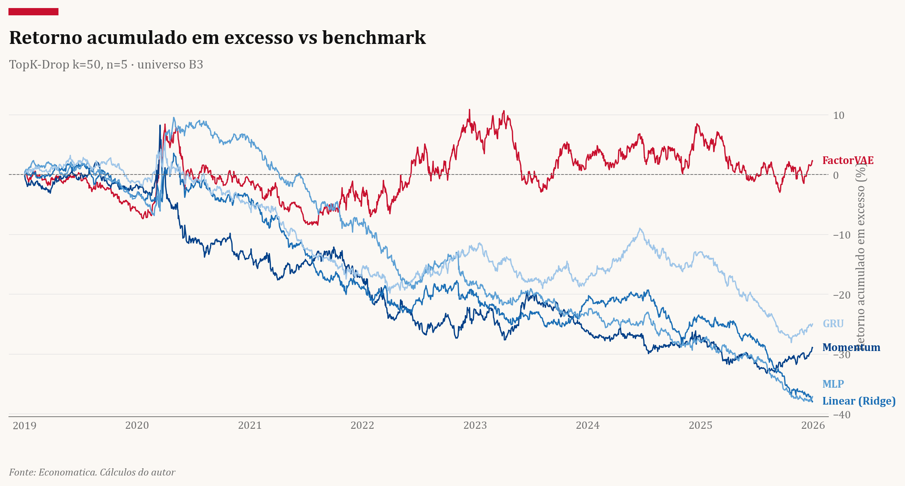
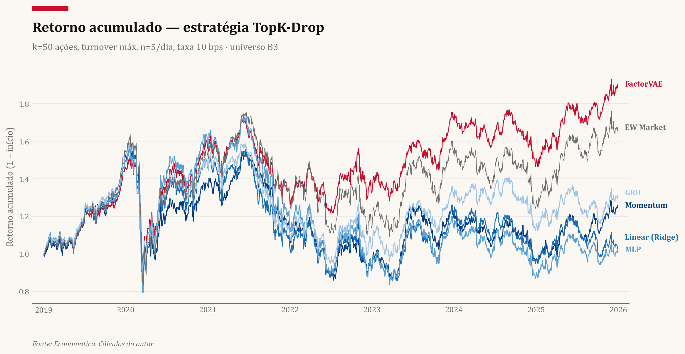
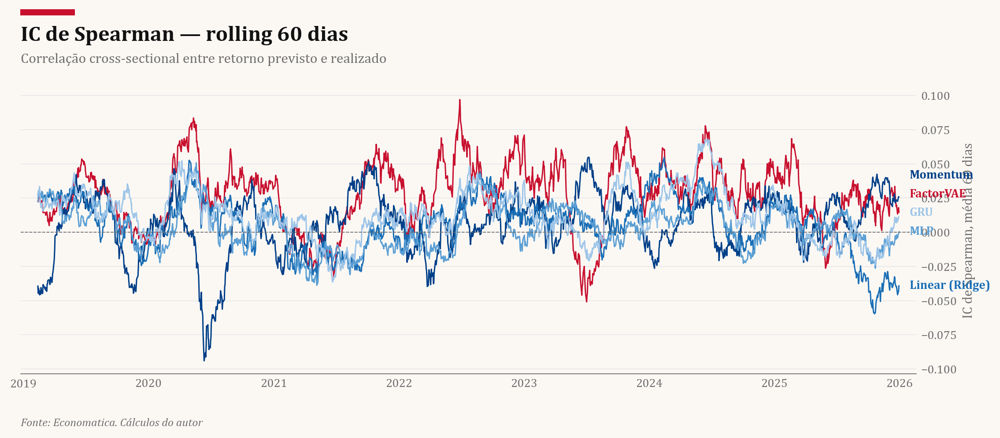
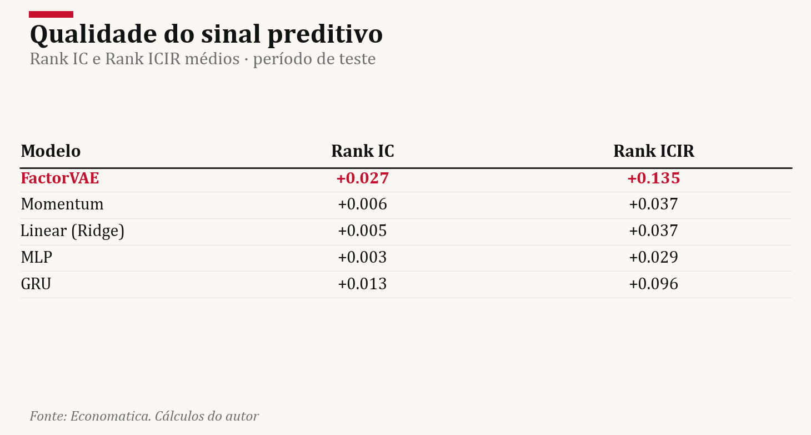
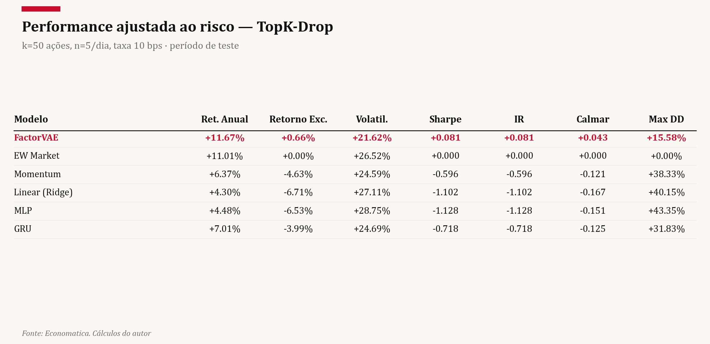
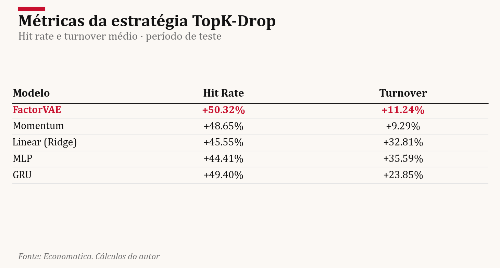

# FactorVAE — Mercado Brasileiro (B3)

Replicacao e extensao de [Duan et al. (2022) *"FactorVAE: A Probabilistic Dynamic Factor Model Based on Variational Autoencoder for Predicting Cross-Sectional Stock Returns"*](https://ojs.aaai.org/index.php/AAAI/article/view/20369) aplicada ao universo de acoes da B3, periodo 2010-2025.

---



*Estrategia TopK-Drop, k=50 acoes, n=5 substituicoes/dia, taxa de 10 bps. O FactorVAE (vermelho) mantem alfa positivo ao longo de todo o periodo de teste (2019-2025), enquanto todos os benchmarks perdem consistentemente para o mercado igual-ponderado.*

---

## Conteudo

1. [O Problema](#1-o-problema)
2. [Metodologia](#2-metodologia)
   - [Dados e features](#21-dados-e-features)
   - [Arquitetura do modelo](#22-arquitetura-do-modelo)
   - [Funcao objetivo](#23-funcao-objetivo)
   - [Estrategia de portfolio](#24-estrategia-de-portfolio)
3. [Resultados](#3-resultados)
4. [Como reproduzir](#4-como-reproduzir)
5. [Estrutura do repositorio](#5-estrutura-do-repositorio)

---

## 1. O Problema

Prever retornos *cross-seccionais* de acoes e um dos problemas centrais de financas quantitativas. A pergunta e objetiva: dadas as caracteristicas historicas de $N$ acoes ate a data $t$, qual o ranqueamento dos retornos futuros $y_{t+1}$?

O desafio no mercado brasileiro e triplo:

- **Universo pequeno e liquidez irregular.** A B3 tem ~400 papeis com liquidez razoavel contra 3.000+ nos EUA. A cross-section muda de tamanho por data.
- **Regimes macroeconomicos volateis.** Selic saindo de 2% para 14,75%, dois choques cambiais, pandemia e ciclos eleitorais comprimem e esticam premios de risco de forma nao estacionaria.
- **Microestrutura.** Bid-ask spreads altos e baixa profundidade de book penalizam estrategias de alta rotatividade, tornando crucial modelar incerteza e controlar turnover.

### O modelo de fatores dinamicos

O FactorVAE adota a formulacao de Dynamic Factor Model como prior estrutural:

$$y_s = \alpha_s + \sum_{k=1}^{K} \beta_s^{(k)} \, z_s^{(k)} + \epsilon_s$$

onde:
- $y_s \in \mathbb{R}^{N_s}$ — retornos observados na cross-section da data $s$
- $\alpha_s \in \mathbb{R}^{N_s}$ — retornos idiossincraticos (ruido de cada ativo)
- $\beta_s \in \mathbb{R}^{N_s \times K}$ — exposicoes aos fatores (cargas, dinamicas por data)
- $z_s \in \mathbb{R}^K$ — fatores latentes do mercado na data $s$
- $\epsilon_s$ — ruido de media zero

A contribuicao do FactorVAE e tratar $z_s$ como **variavel aleatoria gaussiana** inferida via Variational Autoencoder, em vez de estima-la por minimos quadrados como no PCA ou APT classico. Isso permite (a) quantificar incerteza sobre os fatores, (b) aprender representacoes nao-lineares das exposicoes $\beta$ via redes neurais, e (c) separar o que o modelo sabe a priori (a partir de $x$) do que os retornos observados revelam (posterior).

---

## 2. Metodologia

### 2.1 Dados e features

**Universo.** Todas as acoes ordinarias e preferenciais da B3 com historico de pelo menos 60 dias uteis no periodo relevante. O universo valido e recalculado a cada data — tickers com dados faltantes sao excluidos da cross-section daquele dia.

**Splits temporais** (sem sobreposicao, sem olhar a frente):

| Split | Periodo | Uso |
|-------|---------|-----|
| Treino | 2010-01-01 a 2017-12-31 | Gradiente, normalizacao |
| Validacao | 2018-01-01 a 2018-12-31 | Early stopping, selecao de hiperparametros |
| Teste | 2019-01-01 a 2025-12-31 | Todas as metricas reportadas |

**Features** ($C = 20$ caracteristicas por ativo por dia, janela $T = 20$ dias uteis):

Cada feature e calculada como janela estritamente backward a partir da data de predicao, sem uso de dados futuros. O target $y^{(i)}$ e o retorno $(p_{t+2} - p_{t+1})/p_{t+1}$ — o lag de um dia previne look-ahead ao preco de fechamento do dia corrente.

**Normalizacao cross-sectional.** A cada data, as features sao normalizadas via z-score transversal (media e desvio dos tickers daquela data). Nenhuma estatistica do treino vaza para validacao ou teste.

### 2.2 Arquitetura do modelo

O modelo encadeia quatro redes em torno de um **embedding compartilhado** $e \in \mathbb{R}^{N \times H}$:

| Modulo | Simbolo | Entrada | Saida | Quando opera |
|--------|---------|---------|-------|--------------|
| Feature Extractor | $\phi_\text{feat}$ | $x \in \mathbb{R}^{N \times T \times C}$ | $e \in \mathbb{R}^{N \times H}$ | Sempre |
| Factor Encoder | $\phi_\text{enc}$ | $(y, e)$ | $(\mu_\text{post}, \sigma_\text{post}) \in \mathbb{R}^K$ | Apenas no treino |
| Factor Predictor | $\phi_\text{pred}$ | $e$ | $(\mu_\text{prior}, \sigma_\text{prior}) \in \mathbb{R}^K$ | Treino e inferencia |
| Factor Decoder | $\phi_\text{dec}$ | $(\mu_z, \sigma_z, e)$ | $(\mu_y, \sigma_y) \in \mathbb{R}^N$ | Treino e inferencia |

#### Feature Extractor

Uma projecao linear com LeakyReLU seguida de GRU acumula contexto temporal. O embedding $e^{(i)} = h_\text{GRU}^{(i,T)}$ — o hidden state do ultimo passo — resume os $T$ dias de historico de cada ativo:

$$h_\text{proj}^{(i,t)} = \text{LeakyReLU}(W_\text{proj}\, x^{(i,t)} + b_\text{proj}), \qquad e^{(i)} = \text{GRU}(h_\text{proj}^{(i,\cdot)})_T$$

Os pesos sao compartilhados entre todos os $N$ tickers — a mesma rede processa cada ativo independentemente.

#### Factor Encoder (oraculo de treino)

O encoder usa $y$ observado (informacao futura) para inferir a distribuicao *posterior* dos fatores. Opera apenas durante o treino — e o "professor" que o predictor aprende a imitar.

Internamente, constroi $M$ portfolios dinamicos cujos pesos dependem dos embeddings:

$$a_p^{(i,j)} = \frac{\exp(W_p e^{(i)})^{(j)}}{\sum_{i'} \exp(W_p e^{(i')})^{(j)}}, \qquad y_p^{(j)} = \sum_i y^{(i)} a_p^{(i,j)}$$

Esse passo reduz a dimensao variavel $N \to M$ fixo, tornando o encoder invariante ao tamanho da cross-section. Os $M$ retornos de portfolio sao mapeados para os parametros da posterior via camadas lineares com Softplus nas variancias.

#### Factor Predictor (inferencia)

O predictor nao ve $y$. Ele usa **Multi-Head Global Attention** para agregar informacao dos $N$ ativos em $K$ representacoes globais do mercado:

$$a_\text{att}^{(i)} \propto \max\!\left(0,\; \frac{q \cdot k^{(i)}}{\|q\|_2 \|k^{(i)}\|_2}\right), \qquad h_\text{muti}^{(k)} = \sum_i a_\text{att}^{(i)} v^{(i)}$$

O query $q \in \mathbb{R}^H$ e um parametro aprendivel — cada uma das $K$ heads aprende a "perguntar" algo diferente ao mercado. A similaridade cosseno com ReLU (em vez do softmax padrao de Transformers) zera scores negativos e normaliza apenas pelos positivos, produzindo atencao esparsa.

#### Factor Decoder

O decoder converte a distribuicao de fatores $(\mu_z, \sigma_z)$ em distribuicao de retornos por composicao analitica — **sem amostrar**:

$$\mu_y^{(i)} = \mu_\alpha^{(i)} + \sum_k \beta^{(i,k)} \mu_z^{(k)}$$

$$\sigma_y^{(i)} = \sqrt{(\sigma_\alpha^{(i)})^2 + \sum_k (\beta^{(i,k)})^2 (\sigma_z^{(k)})^2}$$

onde $(\mu_\alpha, \sigma_\alpha)$ vem de uma rede sobre $e$ (retorno idiossincratico por ativo), e $\beta$ e uma projecao linear de $e$ sobre $\mathbb{R}^K$ (exposicoes fatoriais). Como tudo e gaussiano e independente, a soma e fechada — nenhum Monte Carlo e necessario. A variancia preditiva $\sigma_y^{(i)}$ tem interpretacao estrutural: decompoem-se em componente idiossincrática e componente fatorial.

### 2.3 Funcao objetivo

$$\mathcal{L}(x, y) = \underbrace{-\frac{1}{N}\sum_i \log \mathcal{N}(y^{(i)};\, \mu_y^{(i)}, \sigma_y^{(i)})}_{\text{reconstrucao (NLL)}} + \;\gamma\; \underbrace{\text{KL}\!\left(q_\text{enc}(z|x,y) \;\|\; p_\text{pred}(z|x)\right)}_{\text{regularizacao}}$$

A reconstrucao usa sempre a **posterior** (o encoder enxerga $y$). O KL empurra o predictor para imitar o encoder. Ambos os termos sao computaveis em forma fechada — sem reparameterization trick ou Monte Carlo na loss.

O KL entre duas gaussianas diagonais e:

$$\text{KL}(\mathcal{N}(\mu_q, \sigma_q^2) \| \mathcal{N}(\mu_p, \sigma_p^2)) = \log\frac{\sigma_p}{\sigma_q} + \frac{\sigma_q^2 + (\mu_q - \mu_p)^2}{2\sigma_p^2} - \frac{1}{2}$$

somado sobre os $K$ fatores independentes.

**Hiperparametros** (valores usados neste experimento):

| Parametro | Valor | Descricao |
|-----------|-------|-----------|
| $H$ | 20 | Dimensao do embedding |
| $K$ | 8 | Numero de fatores latentes |
| $M$ | 64 | Numero de portfolios do encoder |
| $T$ | 20 | Janela temporal (dias uteis) |
| $\gamma$ | 1.0 | Peso do KL |
| lr | 1e-3 | Taxa de aprendizado (Adam) |
| epocas | 10 | Epocas de treino |

### 2.4 Estrategia de portfolio

A avaliacao usa a estrategia **TopK-Drop** com controle de turnover:

1. **Sinal:** rankear todos os ativos por $\mu_\text{pred}^{(i)}$ na data $t$.
2. **Top-K:** manter os $k = 50$ mais bem ranqueados em carteira, pesos iguais.
3. **Restricao de turnover:** substituir no maximo $n = 5$ ativos por dia.
4. **Custo de transacao:** 10 bps por operacao (compra e venda).
5. **Benchmark:** mercado igual-ponderado (EW Market) sobre o mesmo universo.

O controle de turnover e motivado pela microestrutura da B3: alta rotatividade em acoes iliquidas pode consumir todo o alfa em spread e impacto de mercado.

---

## 3. Resultados

Periodo de teste: **2019-01-01 a 2025-12-31** (7 anos fora da amostra de treino e validacao).

### Retorno acumulado em excesso


O alfa acumulado do FactorVAE e positivo durante todo o periodo de teste. Os quatro benchmarks alternativos perdem consistentemente para o mercado. A separacao se torna mais clara apos 2022, sugerindo que a estrutura fatorial captura algo sobre o regime pos-pandemia na B3 — possivelmente a maior dispersao setorial e a rotacao entre value e growth.

### Retorno acumulado



O FactorVAE entrega retorno acumulado de ~86% no periodo (vs. ~62% do EW Market). O EW Market (cinza solido) serve de referencia de buy-and-hold. O GRU puro fica proximo do mercado, confirmando que a sequencia temporal ajuda — mas a estrutura VAE fatorial adiciona o salto final.

### Qualidade do sinal preditivo (Rank IC rolling)



O FactorVAE (vermelho) tem IC medio de 0.027, acima de todos os benchmarks. O GRU puro (0.013) e o segundo melhor, confirmando que a estrutura temporal agrega valor mesmo sem a componente probabilistica fatorial. O IC do FactorVAE e mais estavel e frequentemente positivo em periodos em que os benchmarks ficam negativos.

### Tabelas comparativas







**Leitura dos resultados:**

- **FactorVAE e o unico modelo com Sharpe positivo (+0.081)** no periodo de 7 anos fora da amostra.
- O **EW Market** serve de referencia de buy-and-hold: retorno anualizado de ~11%, Sharpe zero por definicao (e o proprio benchmark). Nenhum benchmark bate o mercado.
- **GRU puro** (+7.0% anual, Sharpe -0.718) supera os modelos estaticos (MLP, Ridge, Momentum), validando que a estrutura temporal e util — mas a componente VAE fatorial e o que gera alfa real.
- **Hit rate de 50.3%** do FactorVAE vs 48-49% dos demais indica que o ganho vem de acertar quando importa (magnitude de retorno), nao de frequencia bruta de acerto.
- **Turnover de apenas 11.2%** (5 trocas/dia sobre 50 posicoes) mostra que a estrategia e implementavel na B3 sem consumir o alfa em custos.

---

## 4. Como reproduzir

### Instalacao

```bash
pip install -e .
```

### Pipeline completo

```bash
# 1. Processar features brutas -> parquets em data/processed/
python scripts/build_features.py

# 2. Treinar o modelo
python scripts/train.py

# 3. Inferencia + backtest + figuras
python scripts/evaluate.py

# 4. Benchmarks (Momentum, Ridge, MLP, GRU)
python benchmarks/run_benchmarks.py

# 5. Regenerar apenas figuras/tabelas (se predicoes ja existem)
python scripts/backtest.py
```

### Suite de testes

```bash
pytest tests/ -q    # 79 testes, ~74 s
```

---

## 5. Estrutura do repositorio

```
FactorVAE/
|-- config.yaml                   # Hiperparametros e splits temporais
|
|-- src/factorvae/
|   |-- data/
|   |   |-- dataset.py            # RealDataset: tensores por data
|   |   `-- datamodule.py         # LightningDataModule + MacroNormalizer
|   |-- models/
|   |   |-- feature_extractor.py  # GRU encoder temporal
|   |   |-- factor_encoder.py     # Portfolio Layer + Mapping Layer
|   |   |-- factor_predictor.py   # Multi-Head Global Attention
|   |   |-- factor_decoder.py     # Alpha + Beta + composicao analitica
|   |   `-- factorvae.py          # Modulo raiz: forward_train / forward_predict
|   |-- training/
|   |   |-- lightning_module.py   # Loop de treino/val Lightning
|   |   `-- losses.py             # NLL + KL analitico
|   `-- evaluation/
|       |-- backtest.py           # TopK-Drop, metricas de performance
|       |-- comparison.py         # Tabela comparativa multi-modelo
|       |-- metrics.py            # Rank IC, Rank ICIR, rolling IC
|       |-- plot_style.py         # Tema visual (Cambria, paleta Insper)
|       `-- plot_table.py         # Renderizador de tabelas PNG
|
|-- benchmarks/
|   |-- momentum.py               # Feature ret_20d puro
|   |-- linear_model.py           # Ridge sobre features do ultimo dia
|   |-- mlp.py                    # MLP 2 camadas, ultimo timestep
|   |-- gru.py                    # GRU puro sem VAE
|   `-- run_benchmarks.py         # Roda todos e salva parquets
|
|-- scripts/
|   |-- train.py                  # Treino com PyTorch Lightning
|   |-- evaluate.py               # Inferencia -> predicoes -> backtest
|   `-- backtest.py               # Backtest standalone + figuras
|
|-- data/
|   |-- processed/                # features.parquet, returns.parquet, etc.
|   `-- raw/                      # Dados brutos (nao versionados)
|
|-- results/
|   |-- checkpoints/              # best.ckpt, last.ckpt
|   |-- predictions/              # predictions.parquet
|   `-- figures/                  # PNGs gerados pelo backtest
|
`-- tests/                        # 79 testes unitarios e de integracao
```

---

## Referencia

Duan, S., Zhang, K., Wang, G., & Liu, Q. (2022). **FactorVAE: A Probabilistic Dynamic Factor Model Based on Variational Autoencoder for Predicting Cross-Sectional Stock Returns**. *Proceedings of the AAAI Conference on Artificial Intelligence*, 36(4), 4468-4476.
