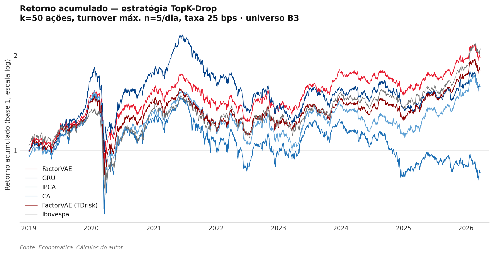
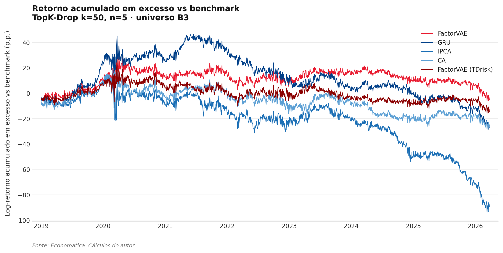
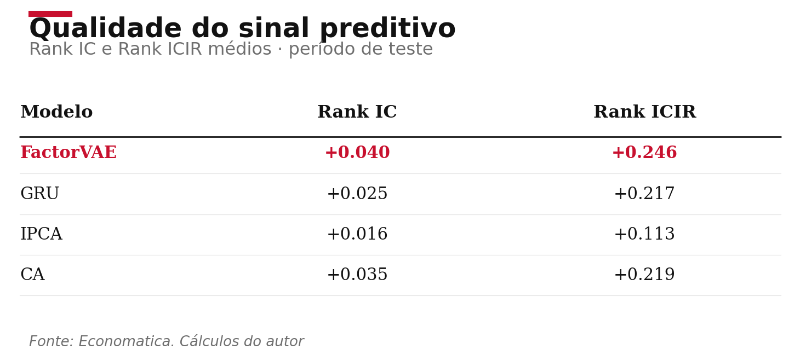
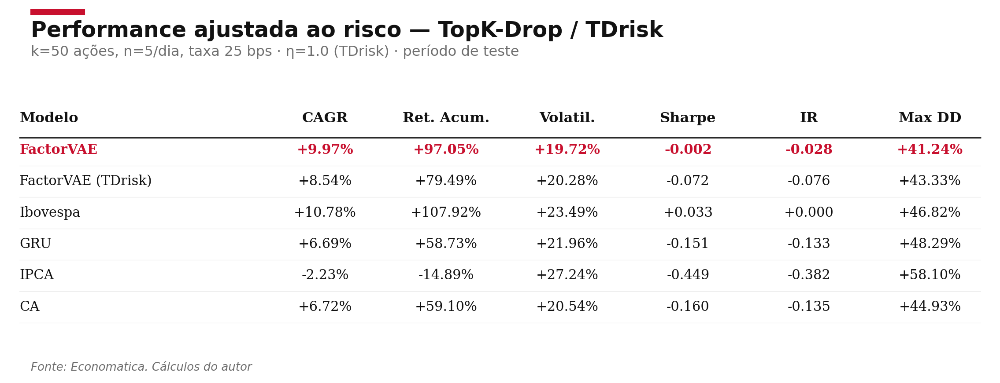
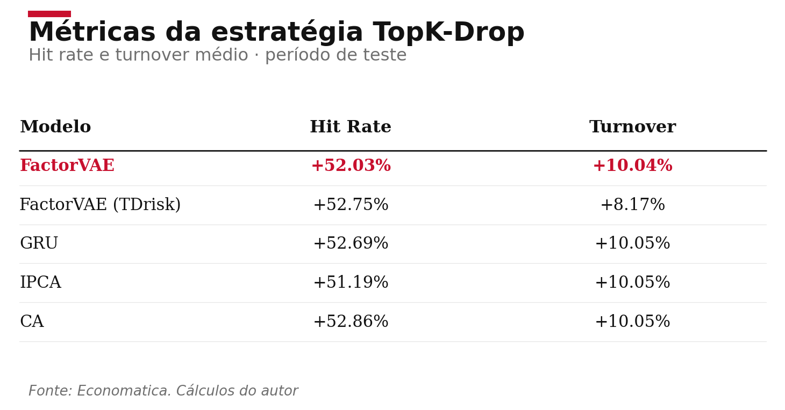

# FactorVAE no mercado brasileiro (B3)

Este documento resume e interpreta os resultados do run:

- `results/runs/20260510_000234_97ad920d`
- recorte principal: `results/runs/20260510_000234_97ad920d/full_universe`

Todos os números abaixo vêm dos artefatos desse run (principalmente `comparison_table.csv` e os PNGs comparativos).

## 1. Objetivo do experimento

O objetivo aqui nao e apenas medir acuracia estatistica, mas avaliar se o sinal preditivo converte em resultado economico em uma carteira com friccao.

Setup usado no run (conforme os titulos dos graficos):

- Estrategia: TopK-Drop.
- Universo: B3 (full universe).
- Carteira: `k=50` acoes.
- Restricao de giro: `n=5` trocas por dia.
- Custo: `25 bps`.
- Variantes avaliadas: FactorVAE, FactorVAE (TDrisk), GRU, IPCA, CA, com Ibovespa como referencia visual de mercado.

## 2. Leitura executiva

Resultado em uma frase: o FactorVAE foi o melhor entre os modelos do experimento em qualidade de sinal e em retorno acumulado da estrategia, mas nao superou o Ibovespa em CAGR no periodo.

Interpretacao objetiva:

- O modelo lidera em qualidade de ordenacao cross-section (Rank IC e Rank ICIR).
- Essa vantagem estatistica foi convertida em melhor curva acumulada entre os modelos comparados no CSV.
- O perfil de risco e mais contido que o Ibovespa (menor volatilidade e menor max drawdown), mas com retorno anualizado um pouco menor.
- A versao TDrisk melhora o controle operacional (menor turnover), porem com custo de retorno.

## 3. Qualidade do sinal preditivo

Fonte: `comparison_table.csv` e `RIC_comparison_ic.png`.

| Modelo | Rank IC | Rank ICIR |
|---|---:|---:|
| **FactorVAE** | **+0.040** | **+0.246** |
| GRU | +0.025 | +0.217 |
| IPCA | +0.016 | +0.113 |
| CA | +0.035 | +0.219 |

Interpretacao:

- O FactorVAE tem a melhor capacidade media de ranquear ativos e tambem a melhor estabilidade desse sinal (ICIR).
- O CA aparece como concorrente forte em ICIR, mas ainda abaixo do FactorVAE.
- O gap para IPCA e relevante tanto em nivel de IC quanto em consistencia, sugerindo menor poder de discriminacao desse baseline.

Leitura economica:

- Em estrategias long-only TopK, um ganho pequeno e persistente de Rank IC tende a acumular bastante no horizonte longo.
- Este run segue exatamente esse padrao: a lideranca em sinal aparece refletida na curva de retorno acumulado da estrategia.

## 4. Performance ajustada ao risco

Fonte: `comparison_table.csv` e `BKT_comparison_performance.png`.

| Modelo | CAGR | Ret. Acum. | Volatil. | Sharpe | IR | Max DD |
|---|---:|---:|---:|---:|---:|---:|
| **FactorVAE** | **+9.97%** | **+97.05%** | **+19.72%** | **-0.002** | **-0.028** | **+41.24%** |
| FactorVAE (TDrisk) | +8.54% | +79.49% | +20.28% | -0.072 | -0.076 | +43.33% |
| Ibovespa | +10.78% | +107.92% | +23.49% | +0.033 | +0.000 | +46.82% |
| GRU | +6.69% | +58.73% | +21.96% | -0.151 | -0.133 | +48.29% |
| IPCA | -2.23% | -14.89% | +27.24% | -0.449 | -0.382 | +58.10% |
| CA | +6.72% | +59.10% | +20.54% | -0.160 | -0.135 | +44.93% |

Interpretacao:

- Entre os modelos do experimento, o FactorVAE entrega a melhor combinacao de retorno acumulado e risco.
- Frente ao Ibovespa, o trade-off e claro: menor risco (vol e drawdown menores), mas retorno anualizado tambem menor.
- O Sharpe do FactorVAE fica praticamente neutro (-0.002), o que indica que o retorno anualizado ficou muito proximo da taxa de referencia usada no calculo.
- A versao TDrisk reduz retorno sem melhorar drawdown de forma material neste run especifico.

Ponto importante de interpretacao:

- Nao e correto concluir "FactorVAE domina tudo". O que os dados mostram e:
- Lideranca robusta versus GRU/IPCA/CA dentro do conjunto de modelos testado.
- Competicao equilibrada com o benchmark de mercado (Ibovespa), com vantagem de risco para o modelo e vantagem de retorno para o indice no periodo observado.

## 5. Metricas operacionais da estrategia

Fonte: `comparison_table.csv` e `BKT_comparison_strategy.png`.

| Modelo | Hit Rate | Turnover |
|---|---:|---:|
| FactorVAE | +52.03% | +10.04% |
| FactorVAE (TDrisk) | +52.75% | +8.17% |
| GRU | +52.69% | +10.05% |
| IPCA | +51.19% | +10.05% |
| CA | +52.86% | +10.05% |

Interpretacao:

- Os hit rates sao proximos (faixa de ~51% a ~53%), entao a diferenca de performance nao vem apenas de "acertar mais dias".
- O diferencial aparece na qualidade do ranking e na trajetoria de acumulacao ao longo do tempo.
- O TDrisk e o mais eficiente em giro (8.17%), mas sacrificou retorno acumulado de forma visivel.

Implicacao pratica:

- Para uma mesa que prioriza menor rotacao operacional, TDrisk pode ser interessante.
- Para objetivo de retorno total no periodo desse run, o FactorVAE padrao foi superior.

## 6. Leitura dos graficos

### 6.1 Retorno acumulado da estrategia



- O FactorVAE termina acima dos demais modelos do CSV.
- O Ibovespa fecha o periodo em nivel acumulado superior ao FactorVAE.
- O IPCA se descola negativamente no trecho final da amostra.

### 6.2 Retorno acumulado em excesso vs benchmark



- O excesso do FactorVAE oscila em torno de zero no fim da amostra.
- Em relacao aos baselines de modelo, a curva do FactorVAE permanece mais resiliente.
- O IPCA mostra deterioracao acentuada e persistente.

### 6.3 Qualidade de sinal (IC e ICIR)



- O topo da tabela confirma o ganho de sinal do FactorVAE.
- A diferenca para CA/GRU existe, mas e incremental, nao ordens de grandeza.

### 6.4 Tabelas visuais do run





## 7. Conclusoes do run (sem extrapolacao)

1. O FactorVAE foi o melhor modelo dentro do conjunto testado em sinal e retorno acumulado da estrategia.
2. O Ibovespa teve CAGR maior no periodo, apesar de maior risco (volatilidade e drawdown superiores).
3. O TDrisk melhorou giro, mas nao melhorou o resultado final de retorno neste recorte.
4. O ganho do FactorVAE parece vir mais da qualidade e consistencia de ranking do que de diferencas grandes de hit rate.

## 8. Limites de inferencia

- Este README descreve um run especifico (20260510_000234_97ad920d).
- Conclusoes nao devem ser generalizadas automaticamente para outros periodos/regimes sem validacao adicional.
- Custos, restricoes de giro e composicao de universo impactam materialmente o resultado.

## 9. Estrutura dos artefatos do run

```text
results/runs/20260510_000234_97ad920d/
├── run_info.json
├── full_universe/
│   ├── comparison_table.csv
│   ├── BKT_comparison_performance.png
│   ├── BKT_comparison_strategy.png
│   ├── BKT_cumulative_excess_return.png
│   ├── BKT_cumulative_return.png
│   ├── RIC_comparison_ic.png
│   └── RIC_rolling_rank_ic.png
├── predictions/
├── robustness_missing/
└── figures/
```

## 10. Reproducao

```bash
pip install -e .
python scripts/build_features.py
python scripts/train.py
python scripts/evaluate.py
python benchmarks/run_benchmarks.py
python scripts/backtest.py
```

Testes:

```bash
pytest tests/ -q
```

## 11. Referencia

Duan, S., Zhang, K., Wang, G., & Liu, Q. (2022). FactorVAE: A Probabilistic Dynamic Factor Model Based on Variational Autoencoder for Predicting Cross-Sectional Stock Returns. Proceedings of the AAAI Conference on Artificial Intelligence, 36(4), 4468-4476.
