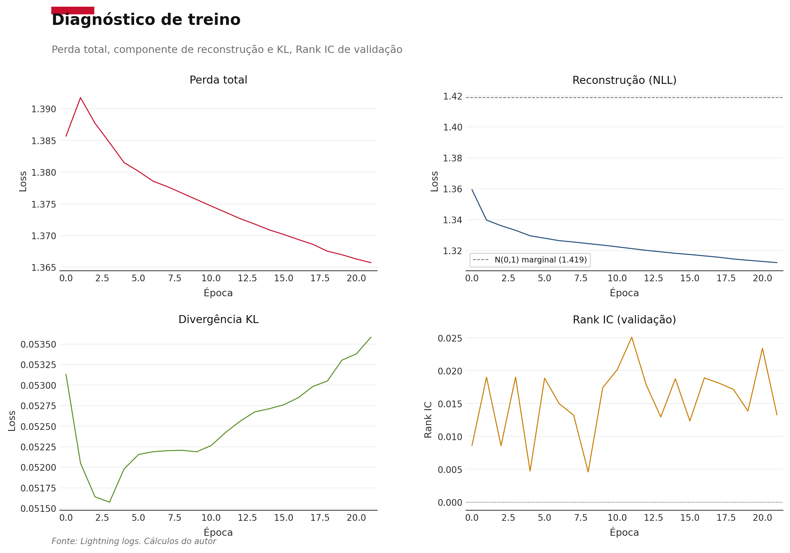
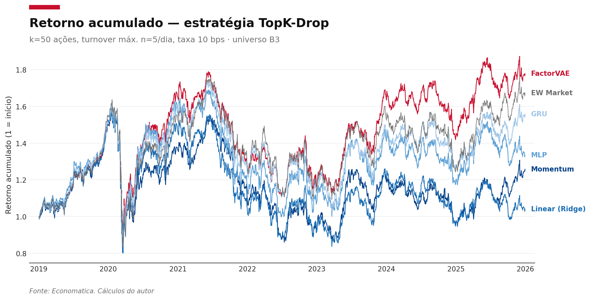
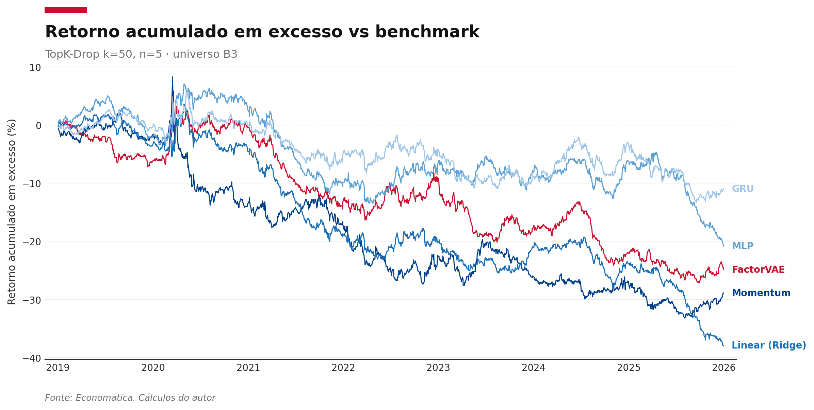
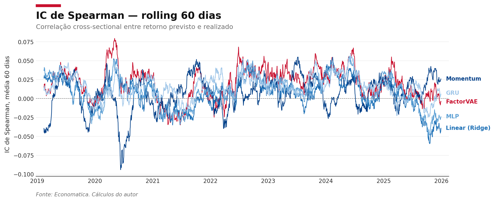

# FactorVAE - Mercado Brasileiro (B3)

Implementacao do FactorVAE aplicada a acoes da B3, com foco em previsao cross-sectional de retornos e avaliacao economica via estrategia TopK-Drop.

O projeto compara o FactorVAE com benchmarks simples e neurais sobre o periodo de teste de 2019-01-01 a 2025-12-31. O resultado principal da versao atual e direto: o modelo entrega a melhor combinacao entre retorno absoluto, qualidade de sinal e implementabilidade entre os modelos testados, embora o excesso anualizado contra o benchmark igual-ponderado fique praticamente neutro depois de custos.

## Conteudo

1. Visao geral
2. Principais resultados
3. Figuras
4. Tabelas comparativas
5. Como reproduzir
6. Estrutura do repositorio

## 1. Visao geral

O FactorVAE combina:

- extrator temporal com GRU para resumir o historico recente de cada ativo;
- fatores latentes probabilisticos para modelar o estado do mercado;
- decoder fatorial para mapear fatores em retornos previstos por ativo;
- avaliacao economica em carteira, nao apenas metricas estatisticas.

O backtest usa uma estrategia TopK-Drop com:

- `k = 50` acoes em carteira;
- `n = 5` substituicoes maximas por dia;
- custo de transacao de `10 bps`;
- benchmark `EW Market` sobre o mesmo universo.

## 2. Principais resultados

- O FactorVAE foi o melhor modelo em retorno anualizado, com `10.95%` ao ano, levemente abaixo do `EW Market` em retorno em excesso anualizado (`-0.05%`), mas acima de todos os outros sinais alternativos.
- O sinal do modelo foi o melhor em Rank IC medio (`0.020`) e empatou a melhor leitura de Rank ICIR (`0.118`).
- A estrategia teve o maior hit rate do conjunto (`50.09%`), mas sem exigir o maior turnover. O turnover medio foi `18.07%`, abaixo de GRU, MLP e Ridge.
- Entre os benchmarks, o GRU foi o competidor mais forte. Ele ficou mais proximo do benchmark em retorno e teve Rank ICIR igual ao do FactorVAE, mas ainda perdeu em retorno final e em hit rate.
- Momentum e Ridge ficaram claramente atras, tanto em retorno acumulado quanto em desempenho ajustado ao risco.

## 3. Figuras

### Diagnostico de treino



Leitura breve: a perda total e a componente de reconstrucao caem de forma gradual, enquanto o Rank IC de validacao permanece positivo na maior parte do treino. O comportamento sugere aprendizado estavel, sem deterioracao clara fora da amostra de validacao.

### Retorno acumulado da estrategia



Leitura breve: o FactorVAE termina o periodo com a maior curva acumulada do grupo, acima do `EW Market` e tambem acima do GRU. A vantagem aparece principalmente do fim de 2023 em diante, quando os modelos lineares e o momentum ficam mais para tras.

### Retorno acumulado em excesso vs benchmark



Leitura breve: contra o benchmark igual-ponderado, o FactorVAE oscila em torno de zero no fim da amostra, mas continua muito acima dos demais benchmarks, que encerram o periodo com excesso acumulado bem negativo. Em outras palavras: o modelo nao gera um alfa folgado contra o benchmark depois de custos, mas ainda domina os sinais alternativos.

### Rank IC rolling de 60 dias



Leitura breve: o Rank IC do FactorVAE e positivo em boa parte da amostra, mas sem superioridade estatica e limpa em todas as janelas. O diferencial do modelo parece vir menos de um IC muito acima do resto em todo instante e mais da combinacao entre sinal competitivo, melhor conversao em carteira e menor degradacao economica que os benchmarks piores.

## 4. Tabelas comparativas

Os arquivos PNG de comparacao continuam em `results/figures`, mas abaixo as mesmas informacoes sao apresentadas em Markdown.

### Qualidade do sinal preditivo

| Modelo | Rank IC | Rank ICIR |
|-------|-------:|----------:|
| FactorVAE | +0.020 | +0.118 |
| Momentum | +0.006 | +0.037 |
| Linear (Ridge) | +0.005 | +0.037 |
| MLP | +0.010 | +0.071 |
| GRU | +0.016 | +0.118 |

Interpretacao breve: o FactorVAE lidera em Rank IC e divide a melhor leitura de Rank ICIR com o GRU. O ganho do modelo nao vem de um salto gigantesco na correlacao media, e sim de uma melhora consistente sobre os modelos mais simples e de uma traducao melhor desse sinal para performance de carteira.

### Performance ajustada ao risco

| Modelo | Ret. Anual | Retorno Exc. | Volatil. | Sharpe | IR | Calmar | Max DD |
|-------|-----------:|-------------:|---------:|-------:|---:|-------:|-------:|
| FactorVAE | +10.95% | -0.05% | +22.79% | -0.007 | -0.007 | -0.003 | +18.72% |
| EW Market | +11.01% | +0.00% | +26.52% | +0.000 | +0.000 | +0.000 | +0.00% |
| Momentum | +6.37% | -4.63% | +24.59% | -0.596 | -0.596 | -0.121 | +38.33% |
| Linear (Ridge) | +4.30% | -6.71% | +27.11% | -1.102 | -1.102 | -0.167 | +40.15% |
| MLP | +7.80% | -3.20% | +26.80% | -0.544 | -0.544 | -0.123 | +26.08% |
| GRU | +9.49% | -1.52% | +24.64% | -0.268 | -0.268 | -0.085 | +17.95% |

Interpretacao breve: o FactorVAE foi o melhor modelo entre os sinais concorrentes em retorno anualizado e tambem um dos melhores em controle de drawdown. O ponto que limita a leitura economica e que, frente ao `EW Market`, o retorno em excesso anualizado ficou praticamente nulo. Ainda assim, contra os benchmarks de modelagem, ele foi claramente superior.

### Metricas operacionais da estrategia

| Modelo | Hit Rate | Turnover |
|-------|---------:|---------:|
| FactorVAE | +50.09% | +18.07% |
| Momentum | +48.65% | +9.29% |
| Linear (Ridge) | +45.55% | +32.81% |
| MLP | +47.45% | +31.16% |
| GRU | +48.19% | +25.10% |

Interpretacao breve: o FactorVAE foi o unico modelo acima de 50% de hit rate e nao exigiu o turnover extremo de Ridge, MLP ou mesmo GRU. Isso ajuda a explicar por que um ganho moderado em qualidade de sinal se converteu em melhor resultado final de carteira.

## 5. Como reproduzir

### Instalacao

```bash
pip install -e .
```

### Pipeline principal

```bash
# 1. Construir base processada
python scripts/build_features.py

# 2. Treinar o modelo
python scripts/train.py

# 3. Gerar predicoes e avaliar o FactorVAE
python scripts/evaluate.py

# 4. Rodar benchmarks
python benchmarks/run_benchmarks.py

# 5. Regenerar figuras e tabelas comparativas
python scripts/backtest.py
```

### Testes

```bash
pytest tests/ -q
```

## 6. Estrutura do repositorio

```text
FactorVAE/
|-- config.yaml
|-- README.md
|-- benchmarks/
|-- data/
|-- results/
|   |-- checkpoints/
|   |-- predictions/
|   `-- figures/
|-- scripts/
|-- src/factorvae/
`-- tests/
```

## Referencia

Duan, S., Zhang, K., Wang, G., & Liu, Q. (2022). FactorVAE: A Probabilistic Dynamic Factor Model Based on Variational Autoencoder for Predicting Cross-Sectional Stock Returns. Proceedings of the AAAI Conference on Artificial Intelligence, 36(4), 4468-4476.